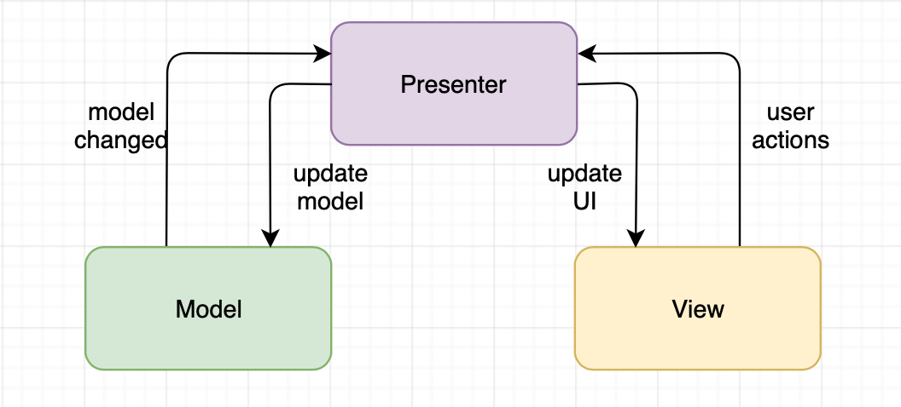
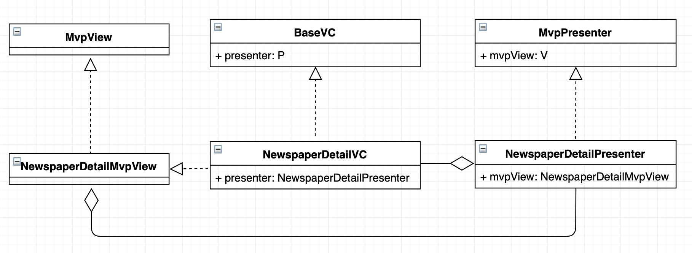
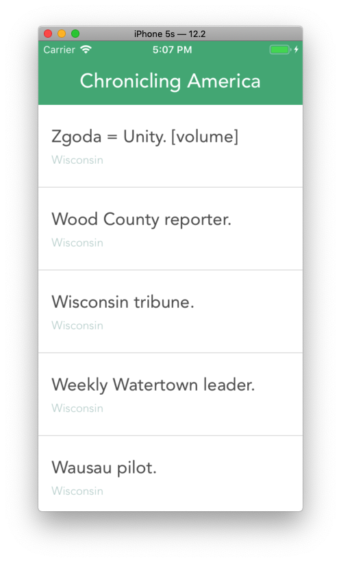
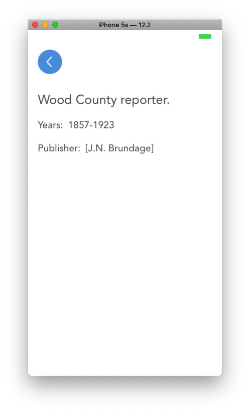

# MVP-Template-iOS

## Description
MVP-Template-iOS is an iOS Swift app that demonstrates a lightweight implementation of MVP pattern in iOS.

## MVP Architecture

## UML diagram of a screen (component)

## Preview 

## Dependencies
The sample app is using next libraries and frameworks:
- [Alamofire](https://github.com/Alamofire/Alamofire)
- [RxSwift](https://github.com/ReactiveX/RxSwift)

## References
- [Clean-swift](http://clean-swift.com)
- [iOS Swift : MVP Architecture](https://medium.com/@saad.eloulladi/ios-swift-mvp-architecture-pattern-a2b0c2d310a3)
- [Library - iOS - MVP + Clean Architecture Demo](https://github.com/FortechRomania/ios-mvp-clean-architecture)

If you have any suggestions or questions feel free to make a Pull Request or contact us!

## Author
#### Ruslan Fedorovych

iOS Developer at [OmiSoft](https://omisoft.net)

<!-- Please don't remove this: Grab your social icons from https://github.com/carlsednaoui/gitsocial -->

[![alt text][1.1]][1]
[![alt text][2.1]][2]

[1]: http://www.twitter.com/omisoftnet
[2]: http://www.facebook.com/omisoftnet

[1.1]: http://i.imgur.com/wWzX9uB.png (twitter icon without padding)
[2.1]: http://i.imgur.com/fep1WsG.png (facebook icon without padding)

## License
MVP-Template-iOS is released under the MIT license.  
See the [LICENSE](./LICENSE.md) for details.